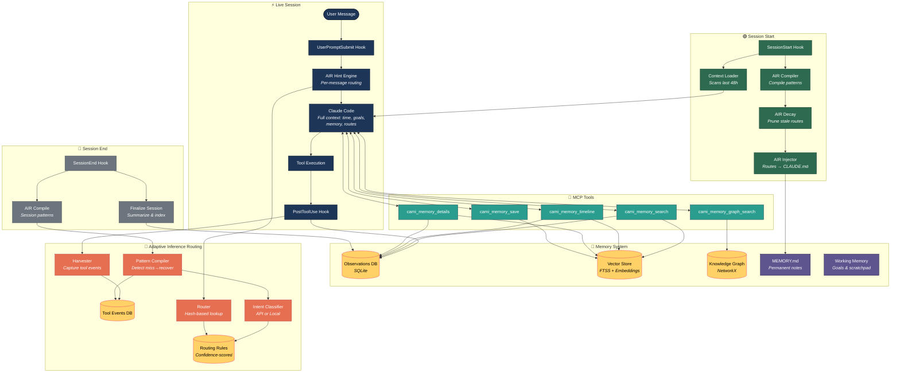
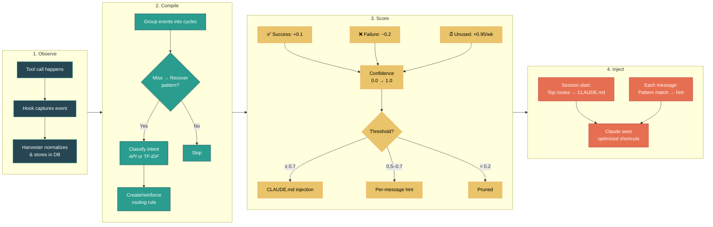
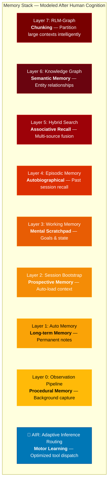

# Claude Cortex

### The memory layer Claude Code is missing. Modeled after the human brain.

---

## What's New

Recent public updates focused on making Cortex easier to trust, easier to run, and easier to improve:

- **Public-safe runtime defaults.** The public worker, vector store, and MCP server now use generic `CORTEX_*` environment variables and `~/.cortex/...` defaults instead of private local paths or machine-specific assumptions.
- **Clearer public entrypoints.** The canonical runtime now lives under `src/`, while the older `scripts/` entrypoints remain as compatibility wrappers for existing local setups.
- **Safer MCP tool contracts.** The memory MCP server now validates tool arguments with explicit schemas so bad inputs fail clearly instead of producing vague runtime errors.
- **Offline test coverage + CI.** The repo now includes an offline-safe test suite for the public `src/` surface and a GitHub Actions workflow to run it automatically.
- **Better retrieval ranking guardrails.** Retrieval now has checked-in ranking fixtures and a small benchmark runner so relevance tuning can be measured instead of guessed.

These changes do not replace the larger Retrieval v2 roadmap. They harden the current system so the public repo is more reproducible, more verifiable, and less dependent on one local environment.

---

## The Problem Nobody Talks About

Claude Code is powerful. But every time you start a new session, it has **total amnesia**. It doesn't remember what you built yesterday, what decisions you made last week, who your teammates are, or what your project even does. You spend the first 5 minutes of every session re-explaining context that should already be known.

This isn't a minor inconvenience. It's the single biggest bottleneck in AI-assisted development.

You wouldn't hire a developer who forgot everything at the end of each workday. So why accept that from your AI agent?

---

## How Humans Remember (And Why It Matters)

Neuroscience has identified distinct memory systems in the human brain, each serving a different purpose. AI agents need the same architecture to function effectively:

| Human Memory | What It Does | AI Equivalent | This System's Layer |
|-------------|-------------|---------------|-------------------|
| **Procedural memory** | Automatic habits and routines | Background observation capture | **Observation Pipeline** |
| **Long-term memory** | Facts you've committed to permanent storage | Permanent notes always available | **Auto Memory** (MEMORY.md) |
| **Prospective memory** | Remembering to do things in the future | Session bootstrap that loads pending work | **Session Bootstrap** |
| **Working memory** | Holding active thoughts while problem-solving | Goals, scratchpad, state tracking | **Working Memory** |
| **Episodic memory** | Recalling specific past experiences and conversations | Searchable index of all past sessions | **Episodic Memory** |
| **Semantic memory** | General knowledge and relationships between concepts | Entity-relationship graph | **Knowledge Graph** |
| **Associative recall** | Finding connections between related memories | Multi-source search fusion | **Hybrid Search** |
| **Chunking** | Breaking complex info into manageable pieces | Graph-based context partitioning | **RLM-Graph** |
| **Motor learning** | Muscle memory for repeated actions | Learned tool-dispatch shortcuts | **AIR** 🎯 |

Humans don't have one type of memory. They have an interconnected system where different memory types reinforce each other. Your AI agent needs the same thing.

---

## What This System Actually Does

### Before: Every Session Starts Cold
```
You: "Continue working on the auth module"
Claude: "I don't have context about an auth module. Can you tell me about your project?"
You: *sighs, spends 10 minutes re-explaining everything*
```

### After: Every Session Picks Up Where You Left Off
```
Claude (automatically, before you say anything):
  ✓ TIME VERIFIED: 4:46 PM on Wednesday
  ✓ Active Goal: Debug auth module [high priority]
  ✓ Last note: "Found JWT validation bug in token rotation"
  ✓ 3 incomplete items from yesterday
  ✓ Session handoff loaded from last night's work

You: "Continue working on the auth module"
Claude: "Picking up from where we left off - the JWT validation bug in token
         rotation. Last session we identified the issue was in the refresh
         logic. Let me check if the fix from yesterday's handoff resolved it..."
```

That's the difference. Zero re-explanation. Instant continuity.

---

## The Memory Stack

Each layer solves a different memory problem. They work independently (implement any one without the others) and compound when combined:

```
Layer 0: Observation Pipeline ── Background capture of every tool use and prompt
Layer 7: RLM-Graph ──────────── When context is too large, partition intelligently
Layer 6: Knowledge Graph ────── Who knows who? What connects to what?
Layer 5: Hybrid Search ──────── Find anything across all memory sources
Layer 4: Episodic Memory ────── "What did I decide about X last month?"
Layer 3: Working Memory ─────── Track goals, notes, and state mid-session
Layer 2: Session Bootstrap ──── Auto-load recent context on startup
Layer 1: Auto Memory ────────── Permanent notes Claude always sees
```

### Layer 0: Observation Pipeline (NEW)
Claude's **procedural memory**. A background worker that automatically captures every tool use, user prompt, and session lifecycle event via Claude Code hooks. Observations are queued in SQLite, processed asynchronously (summarized, indexed), and synced to a unified vector store for search. Exposes 5 MCP tools for token-efficient retrieval: `cami_memory_search` (L1, ~20 tokens/result), `cami_memory_timeline` (L2, ~100 tokens/item), `cami_memory_details` (L3, full text), `cami_memory_save` (manual memory), and `cami_memory_graph_search` (graph-augmented search).

### Layer 1: Auto Memory
Claude's **long-term memory**. A markdown file (MEMORY.md) that's always loaded into the system prompt. Confirmed patterns, key decisions, architecture notes. Survives forever.

### Layer 2: Session Bootstrap
Claude's **prospective memory**. A Python script that runs automatically via a SessionStart hook. Scans the last 48 hours of work, finds incomplete items, loads handoffs from previous sessions, and injects the actual current time (so Claude never guesses the date wrong).

### Layer 3: Working Memory
Claude's **mental scratchpad**. Tracks active goals, timestamped observations, key-value state, and reference pointers. When Claude's context window compresses (hits token limits), working memory persists to disk and reloads. Goals and discoveries survive context loss.

### Layer 4: Episodic Memory
Claude's **autobiographical memory**. A searchable index of all past Claude Code conversations. Supports semantic search (find by meaning), keyword search (find exact terms), and multi-concept AND matching. Ask "What did I decide about the auth approach?" and get ranked results with similarity scores.

### Layer 5: Hybrid Search
Claude's **associative recall**. Combines keyword matching, knowledge graph traversal, and (optionally) vector embeddings into a single ranked result set. Prevents blind spots that any single search method would have.

### Layer 6: Knowledge Graph
Claude's **semantic memory**. A NetworkX graph of entities (people, projects, companies, systems) and their relationships. Makes implicit connections explicit and queryable. "How is Alice connected to ProjectAlpha?" returns the actual graph path with context at every hop.

### Layer 7: RLM-Graph
Claude's **chunking ability**. When a query involves too many entities and relationships to fit in a single context window, RLM-Graph uses the knowledge graph's topology to create meaningful partitions, processes each one, then merges the results. Complex questions that would normally be truncated randomly are instead decomposed intelligently.

### 🎯 AIR: Adaptive Inference Routing
Claude's **motor learning**. Just as humans develop muscle memory for repeated actions, AIR observes tool-call patterns over time and learns optimized shortcuts. When you say "commit the changes" and Claude tries a Skill lookup, fails, then falls back to `git add && git commit` — AIR remembers. Next time, it skips the failed path entirely. The system gets measurably faster per user over time, without any changes to model weights. Supports both Claude API and local TF-IDF classification, with asymmetric confidence scoring (bad routes die fast, good routes accrete slowly). See the full [AIR specification](docs/superpowers/specs/adaptive-inference-routing.md).

---

## Production Results

This system has been running in production since January 2026 across multiple active projects. Here's what baseline Claude Code gives you vs. what Cortex delivers:

### Memory Capacity

| What Claude Knows | Baseline Claude Code | With Cortex |
|---|---|---|
| **Persistent memory** | ~200 lines of MEMORY.md | 1,300+ lines of curated notes, 60+ daily logs, 125+ contact/entity profiles |
| **Searchable history** | None - previous sessions are gone | 7,400+ indexed conversation chunks with 14,500+ cached embeddings |
| **Entity awareness** | None - doesn't know who anyone is | 265+ graph nodes (people, projects, companies) with 230+ tracked relationships |
| **Session startup context** | Zero - cold start every time | Auto-loads active goals, scratchpad notes, session handoffs, 100+ pending items |
| **Relationship queries** | Impossible | Graph traversal across 170+ people, 60+ projects, 12+ organizations |
| **Past decision recall** | "I don't have context on that" | Semantic + keyword search across every past conversation |
| **Context overflow** | Truncates randomly, loses important data | RLM-Graph: decomposes queries using graph topology, nothing lost |

### What That Looks Like In Practice

**Without Cortex** (session 47 on a project):
> "I don't have any context about your project. Could you tell me what you're working on?"

**With Cortex** (session 47 on a project):
> *Before you type anything, Claude already knows:*
> - The exact current time (no more wrong dates)
> - Your active goal from 2 hours ago and its subgoals
> - That your last session ended mid-debug on a specific function
> - 3 pending items from yesterday's work
> - The handoff notes your previous session left behind
> - Every architectural decision you've made this month (searchable)
> - How every person, project, and system in your world connects to each other

The difference isn't incremental. It's the difference between working with someone who has amnesia and working with someone who has been on your team for months.

---

## Why This Works Better Than Alternatives

**vs. Just using CLAUDE.md:** CLAUDE.md is static instructions. This system gives Claude dynamic, searchable, self-updating memory that grows over time.

**vs. RAG pipelines:** RAG retrieves documents. This system retrieves *context* - goals, relationships, decisions, and state - from multiple complementary memory types simultaneously.

**vs. Conversation summaries:** Summaries lose detail. Episodic memory preserves the full reasoning chain. You can read back the exact conversation where a decision was made.

**vs. Vector databases alone:** Vector search finds similar content but misses structured relationships. The knowledge graph captures explicit connections (Alice *manages* ProjectAlpha, ProjectAlpha *depends on* ServiceX) that semantic similarity can't represent.

---

## Project Structure

```
claude-cortex/
├── src/                          # Canonical public runtime surface
│   ├── memory_worker.py          # Layer 0: Background observation processor
│   ├── unified_vector_store.py   # Layer 0: SQLite FTS5 + vector search
│   ├── memory_retriever.py       # Layer 0: 3-layer token-efficient retrieval
│   ├── mcp_memory_server.py      # Layer 0: MCP server for the five cami_* tools
│   ├── knowledge_graph.py        # Layer 6: Entity-relationship graph
│   └── air/                      # 🎯 Adaptive Inference Routing
│       ├── config.py             #    Configuration with env var overrides
│       ├── storage.py            #    SQLite adapter for rules + events
│       ├── harvester.py          #    Telemetry ingestion from hooks
│       ├── compiler.py           #    Pattern detection (miss→recover)
│       ├── classifier.py         #    Intent classification (API or local)
│       ├── router.py             #    Hash-based route lookup engine
│       ├── scorer.py             #    Confidence scoring + decay + pruning
│       └── injector.py           #    CLAUDE.md + hook injection
├── scripts/                      # Helpers and bootstrap utilities
│   ├── air_cli.py                # 🎯 AIR CLI (ingest, compile, inject, hint)
│   ├── context_loader.py         # Layer 2: Session bootstrap
│   ├── working_memory.py         # Layer 3: Goals, scratchpad, state
│   ├── hybrid_search.py          # Layer 5: Multi-source search fusion
│   ├── query_knowledge_graph.py  # Layer 6: Graph query CLI
│   ├── rlm_graph.py              # Layer 7: Recursive context partitioning
│   ├── seed_graph.py             # Layer 6: Graph seeding helper
│   └── start_worker.sh           # Worker lifecycle management
├── hooks/                        # Claude Code lifecycle hooks (AIR-integrated)
│   ├── session_start.sh          # Starts worker + context loader + AIR inject
│   ├── post_tool_use.sh          # Captures observations + feeds AIR harvester
│   ├── user_prompt_submit.sh     # Captures prompts + AIR per-message hints
│   └── session_end.sh            # Finalizes sessions + AIR pattern compilation
├── tests/                        # Offline-safe test suite
│   ├── test_air/                 # AIR module tests (37 tests)
│   └── ...                       # Memory system tests
├── examples/                     # Example configurations
│   ├── MEMORY.md                 # Example MEMORY.md for Layer 1
│   ├── settings.json             # Example Claude Code settings.json
│   └── working_memory_state.json # Example working memory state
├── docs/                         # Architecture and implementation guides
│   ├── 01-ARCHITECTURE-OVERVIEW.md
│   ├── 02-IMPLEMENTATION-GUIDE.md
│   ├── 03-QUICK-START.md
│   └── superpowers/specs/        # Design specifications
│       ├── adaptive-inference-routing.md  # AIR conceptual framework
│       └── 2026-03-14-air-implementation-design.md
├── requirements.txt              # Python dependencies
├── LICENSE
└── README.md
```

---

## Get Started

### Quick Install (5 minutes)

```bash
# 1. Clone the repo
git clone https://github.com/YoungMoneyInvestments/claude-cortex.git
cd claude-cortex

# 2. Install dependencies
pip install -r requirements.txt

# 3. Configure a generic local runtime
export CORTEX_WORKSPACE="$HOME/cortex"
export CORTEX_DATA_DIR="$HOME/.cortex/data"
export CORTEX_LOG_DIR="$HOME/.cortex/logs"
export CORTEX_WORKER_API_KEY="$(python3 - <<'PY'
import secrets
print(secrets.token_hex(16))
PY
)"
mkdir -p "$CORTEX_WORKSPACE/memory" "$CORTEX_WORKSPACE/.planning" "$CORTEX_DATA_DIR" "$CORTEX_LOG_DIR"

# 4. Create your MEMORY.md (Layer 1)
cp examples/MEMORY.md "$CORTEX_WORKSPACE/MEMORY.md"
# Edit it with your project's key facts

# 5. Wire up the hooks in Claude Code settings
# Add to ~/.claude/settings.json (see examples/settings.json):
```

### Run The Offline Test Suite

```bash
python3 -m venv .venv
source .venv/bin/activate
python -m pip install -r requirements.txt
python -m unittest discover -s tests -v
```

The current automated suite stays offline-safe. It exercises the public `src/`
modules against temporary SQLite databases and does not require local services
or live credentials.

### Add Session Bootstrap (15 minutes)

```bash
# Add SessionStart hook to ~/.claude/settings.json:
# "hooks": {
#   "SessionStart": [{
#     "matcher": "",
#     "hooks": [{"type": "command", "command": "/path/to/cortex/hooks/session_start.sh"}]
#   }]
# }

# Test it:
python3 scripts/context_loader.py --hours 48
```

### Add Observation Pipeline (30 minutes)

```bash
# 1. Start the background worker
python3 src/memory_worker.py

# 2. Add all 4 hooks to ~/.claude/settings.json
# (see examples/settings.json for the full configuration)

# 3. Add the MCP server to settings.json
# "mcpServers": {
#   "cortex-memory": {
#     "command": "python3",
#     "args": ["/path/to/cortex/src/mcp_memory_server.py"]
#   }
# }

# 4. Verify
curl http://127.0.0.1:37778/api/health
```

### Add Knowledge Graph (30 minutes)

```bash
# 1. Seed your graph with entities
# Edit scripts/seed_graph.py with your project's entities
python3 scripts/seed_graph.py

# 2. Query it
python3 scripts/query_knowledge_graph.py --stats
python3 scripts/query_knowledge_graph.py --search "Alice"
python3 scripts/query_knowledge_graph.py --related-to "my-project"
python3 scripts/query_knowledge_graph.py --find-path "Alice" "database"
```

| Time | What You Get |
|------|-------------|
| **5 minutes** | Auto Memory - permanent notes across sessions |
| **15 minutes** | + Session Bootstrap - automatic context loading on startup |
| **30 minutes** | + Observation Pipeline - automatic capture of everything Claude does |
| **1 hour** | + Working Memory, Knowledge Graph, Hybrid Search |
| **Half day** | + RLM-Graph for complex queries, full production setup |

Each layer is independent. Start with Layer 1 and add more as needed.

---

## Configuration

Runtime components use environment variables for configuration:

| Variable | Default | Description |
|----------|---------|-------------|
| `CORTEX_WORKSPACE` | `~/cortex` | Root directory for all Cortex data |
| `CORTEX_DATA_DIR` | `~/.cortex/data` | SQLite databases for observations, vectors, and the knowledge graph |
| `CORTEX_LOG_DIR` | `~/.cortex/logs` | Worker log directory |
| `CORTEX_PID_FILE` | `~/.cortex/worker.pid` | Worker PID file location |
| `CORTEX_WORKER_PORT` | `37778` | HTTP port for the memory worker |
| `CORTEX_WORKER_API_KEY` | required | Shared bearer token for hook POST requests |
| `CORTEX_PYTHON` | `python3` | Python interpreter to use |
| `CORTEX_AUTH_PROFILES_PATH` | unset | Optional OAuth fallback auth-profiles.json path for AI compression |
| `CAMIROUTER_URL` | unset | Optional OpenAI-compatible router endpoint for AI compression |
| `CAMIROUTER_API_KEY` | unset | Required when `CAMIROUTER_URL` is set |
| `CORTEX_ENV_FILE` | unset | Optional env file containing `OPENAI_API_KEY=...` |
| `OPENAI_API_KEY` | unset | Optional embedding key when `CORTEX_EMBEDDING_PROVIDER=openai` |
| `AIR_CLASSIFIER_MODE` | `api` | AIR intent classifier: `api` (Claude Haiku) or `local` (TF-IDF) |
| `ANTHROPIC_API_KEY` | unset | Required when `AIR_CLASSIFIER_MODE=api` |

### Workspace Layout

```
$CORTEX_WORKSPACE/
├── MEMORY.md                          # Layer 1: Auto memory
├── memory/                            # Daily logs, handoffs
│   ├── 2026-01-15.md
│   └── session-handoffs/
├── .planning/
│   ├── working-memory.json            # Layer 3: Active state
│   └── knowledge-graph.json           # Layer 6: Entity graph
```

```
$CORTEX_DATA_DIR/
├── cortex-observations.db             # Layer 0: Observation store
├── cortex-vectors.db                  # Layer 0: FTS5 + vector search
├── cortex-knowledge-graph.db          # Layer 6: Entity graph
└── air-routing.db                     # 🎯 AIR: Routing rules + tool events

$CORTEX_LOG_DIR/
└── memory-worker.log                  # Worker logs
```

---

## Guides

| Guide | What It Covers |
|-------|---------------|
| [Architecture Overview](docs/01-ARCHITECTURE-OVERVIEW.md) | How the layers work together, design principles, flow diagrams |
| [Implementation Guide](docs/02-IMPLEMENTATION-GUIDE.md) | Step-by-step code for every layer, copy-paste ready |
| [Quick Start](docs/03-QUICK-START.md) | Get running in 30 minutes, common commands, troubleshooting |

## Requirements

- Claude Code CLI
- Python 3.10+
- `fastapi`, `uvicorn`, `pydantic` (for Layer 0 observation pipeline)
- `networkx` (for Layer 6 knowledge graph)
- Optional: `sqlite-vec`, `openai` (for vector similarity search)

## System Architecture

### Complete Data Flow



### The AIR Pipeline (Adaptive Inference Routing)

AIR learns from your tool-call patterns and eliminates unnecessary lookups over time:



### Memory Layer Architecture



## Key Design Principles

1. **Mirrors human cognition** - Different memory types for different needs, just like the brain
2. **Layers are independent** - Implement any layer without the others
3. **Graceful degradation** - If one layer fails, the rest keep working
4. **Zero manual effort** - Session bootstrap and observation capture require no user intervention
5. **Grows over time** - The knowledge graph and observation history get more valuable with every session
6. **Token-conscious** - MEMORY.md has a ~200 line limit; 3-layer retrieval minimizes token waste
7. **Disk-backed** - Everything persists to files and SQLite, survives restarts and crashes
8. **Zero-cost by default** - FTS5 search needs no API keys; vector search is opt-in

## License

MIT
