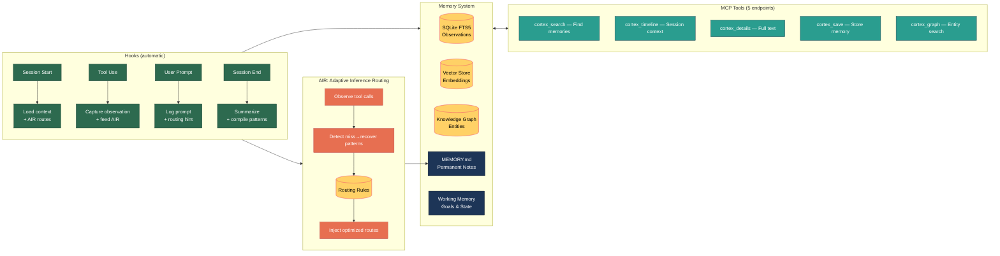

# Claude Cortex

### The memory layer Claude Code is missing. Modeled after the human brain.

---

## The Problem

Every Claude Code session starts with **total amnesia**. It doesn't remember what you built yesterday, what decisions you made, or what your project does. You re-explain everything, every time.

**Cortex fixes this.** It gives Claude persistent, searchable, self-updating memory that picks up exactly where you left off.

```
Without Cortex:  "I don't have context about an auth module. Can you tell me about your project?"
With Cortex:     "Picking up from the JWT validation bug in token rotation. Let me check the fix..."
```

---

## How It Works



---

## The Memory Stack

Each layer is independent. Start with one, add more as needed.

| Layer | Human Analogy | What It Does |
|-------|--------------|-------------|
| **0. Observation Pipeline** | Procedural memory | Background capture of every tool use and prompt |
| **1. Auto Memory** | Long-term memory | Permanent notes (MEMORY.md) Claude always sees |
| **2. Session Bootstrap** | Prospective memory | Auto-loads recent context, goals, and pending work on startup |
| **3. Working Memory** | Mental scratchpad | Tracks goals, notes, and state; survives context compression |
| **4. Episodic Memory** | Autobiographical | Searchable index of all past sessions and decisions |
| **5. Hybrid Search** | Associative recall | Combines keyword, vector, and graph search into ranked results |
| **6. Knowledge Graph** | Semantic memory | Entity relationships (people, projects, systems) |
| **7. RLM-Graph** | Chunking | Partitions large queries intelligently using graph topology |
| **AIR** | Motor learning | Learns optimized tool-dispatch shortcuts from observed patterns |

---

## Adaptive Inference Routing (AIR)

AIR observes tool-call patterns and learns to skip unnecessary steps. When Claude tries tool A, fails, then succeeds with tool B — AIR remembers. Next time, it routes directly to B.

**How it works:**
1. **Observe** — Every tool call is captured by the harvester
2. **Compile** — The pattern compiler detects miss-then-recover sequences
3. **Score** — Confidence increases on success (+0.1), decreases on failure (-0.2), and decays over time
4. **Inject** — High-confidence routes go into CLAUDE.md; medium routes become per-message hints

Rules below 0.2 confidence are pruned. The system self-corrects — bad routes die fast.

See the full [AIR specification](docs/superpowers/specs/adaptive-inference-routing.md).

---

## Get Started

```bash
# Clone and install
git clone https://github.com/YoungMoneyInvestments/claude-cortex.git
cd claude-cortex
pip install -r requirements.txt

# Configure
export CORTEX_WORKSPACE="$HOME/cortex"
export CORTEX_DATA_DIR="$HOME/.cortex/data"
export CORTEX_LOG_DIR="$HOME/.cortex/logs"
export CORTEX_WORKER_API_KEY="$(python3 -c 'import secrets; print(secrets.token_hex(16))')"
mkdir -p "$CORTEX_WORKSPACE/memory" "$CORTEX_DATA_DIR" "$CORTEX_LOG_DIR"

# Create your permanent memory file
cp examples/MEMORY.md "$CORTEX_WORKSPACE/MEMORY.md"

# Wire hooks into Claude Code (see examples/settings.json)
```

| Time | What You Get |
|------|-------------|
| **5 min** | Auto Memory — permanent notes across sessions |
| **15 min** | + Session Bootstrap — automatic context on startup |
| **30 min** | + Observation Pipeline — capture everything Claude does |
| **1 hour** | + Knowledge Graph, Hybrid Search, AIR |

Detailed setup: [Quick Start Guide](docs/03-QUICK-START.md)

---

## Project Structure

```
claude-cortex/
├── src/                         # Core runtime
│   ├── memory_worker.py         # Background observation processor
│   ├── unified_vector_store.py  # SQLite FTS5 + vector search
│   ├── memory_retriever.py      # 3-layer token-efficient retrieval
│   ├── mcp_memory_server.py     # MCP server (5 cortex_* tools)
│   ├── knowledge_graph.py       # Entity-relationship graph
│   └── air/                     # Adaptive Inference Routing
│       ├── config.py            #   Configuration
│       ├── storage.py           #   SQLite storage (rules + events)
│       ├── harvester.py         #   Telemetry ingestion
│       ├── compiler.py          #   Pattern detection
│       ├── classifier.py        #   Intent classification
│       ├── router.py            #   Route lookup engine
│       ├── scorer.py            #   Confidence scoring + decay
│       └── injector.py          #   CLAUDE.md + hook injection
├── scripts/                     # CLI tools and utilities
│   ├── air_cli.py               # AIR CLI (ingest, compile, inject, hint, stats)
│   ├── context_loader.py        # Session bootstrap
│   └── start_worker.sh          # Worker lifecycle management
├── hooks/                       # Claude Code lifecycle hooks
│   ├── session_start.sh         # Context loader + AIR inject
│   ├── post_tool_use.sh         # Observation capture + AIR harvester
│   ├── user_prompt_submit.sh    # Prompt logging + AIR hints
│   └── session_end.sh           # Session finalization + AIR compile
├── tests/                       # Offline-safe test suite
├── docs/                        # Architecture and setup guides
├── examples/                    # Example configurations
├── requirements.txt
└── LICENSE
```

---

## Configuration

| Variable | Default | Description |
|----------|---------|-------------|
| `CORTEX_WORKSPACE` | `~/cortex` | Root directory for all Cortex data |
| `CORTEX_DATA_DIR` | `~/.cortex/data` | SQLite databases |
| `CORTEX_LOG_DIR` | `~/.cortex/logs` | Worker log directory |
| `CORTEX_WORKER_PORT` | `37778` | HTTP port for the memory worker |
| `CORTEX_WORKER_API_KEY` | *required* | Bearer token for hook requests |
| `CORTEX_EMBEDDING_PROVIDER` | `local` | `local` (free) or `openai` |
| `AIR_CLASSIFIER_MODE` | `api` | AIR classifier: `api` (Claude Haiku) or `local` (TF-IDF) |
| `ANTHROPIC_API_KEY` | unset | Required when `AIR_CLASSIFIER_MODE=api` |
| `OPENAI_API_KEY` | unset | Required when `CORTEX_EMBEDDING_PROVIDER=openai` |

Full configuration reference: [Architecture Overview](docs/01-ARCHITECTURE-OVERVIEW.md)

---

## Guides

| Guide | What It Covers |
|-------|---------------|
| [Architecture Overview](docs/01-ARCHITECTURE-OVERVIEW.md) | Layer design, data flow, principles |
| [Implementation Guide](docs/02-IMPLEMENTATION-GUIDE.md) | Step-by-step code for every layer |
| [Quick Start](docs/03-QUICK-START.md) | Get running in 30 minutes |
| [AIR Specification](docs/superpowers/specs/adaptive-inference-routing.md) | Full AIR framework design |

## Requirements

- Claude Code CLI
- Python 3.10+
- `fastapi`, `uvicorn`, `pydantic` (observation pipeline)
- `networkx` (knowledge graph)
- Optional: `sqlite-vec`, `openai` (vector similarity)

## License

MIT
